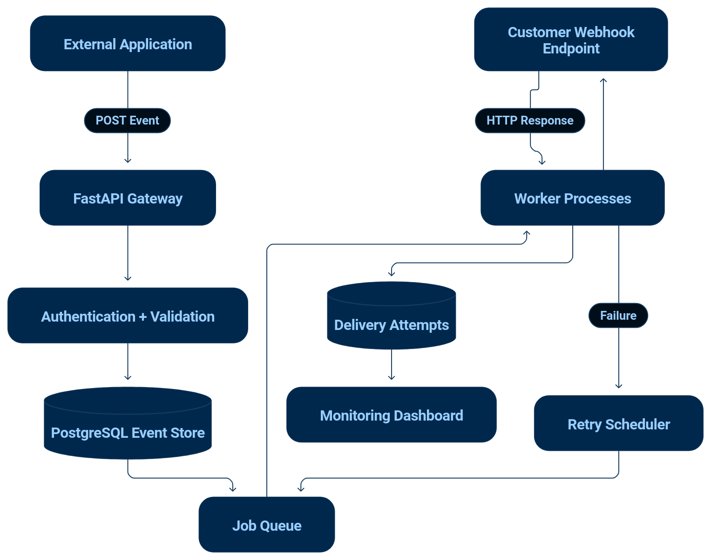

# Relay
Reliable Webhook Delivery &amp; Event Processing Platform

## What is a Webhook?
It is an automated message sent over HTTP from one application to another. 

Webhooks are "user-defined HTTP callbacks".They are usually triggered by some event, such as pushing code to a repository, a purchase, a comment being posted to a blog and many more use cases. When that event occurs, the source site makes an HTTP request to the URL configured for the webhook. Users can configure them to cause events on one site to invoke behavior on another. (Wikipedia)

## Formally defining an event

An event is a specific occurrence or change in state within a source system (like a payment being processed or a git commit)

[Events and Webhooks explained](https://www.shift4.com/blog/events-and-webhooks-explained)

## Webhook delivery platform usage?

It is a dedicated service or infrastructure layer that manages sending, retrying, securing, and monitoring real-time HTTP event notifications (webhooks) from a server to external subscriber endpoints.

- Reliable Delivery & Retries: Automatically retries failed requests using exponential backoff to handle partner downtime.
- Security & Verification: Signs payloads using HMAC (Hash-based Message Authentication Code) so receivers can verify authenticity.
- Logging & Monitoring: Tracks deliverability status codes, response times, and payload history with replay capabilities.
- Queue-Based Architecture: Decouples event triggers from actual HTTP dispatches to handle large volumes without performance loss.

## Example use case

A developer has an e-commerce application. When an order is created, their application sends an event to Relay.

Relay:
- Receives and validates the event.
- Persists it in PostgreSQL.
- Queues delivery jobs.
- Sends the event to subscribed endpoints.
- Retries failed deliveries.
- Records delivery attempts and response codes.
- Allows developers to inspect, replay, or cancel events.

## Core Architecture

